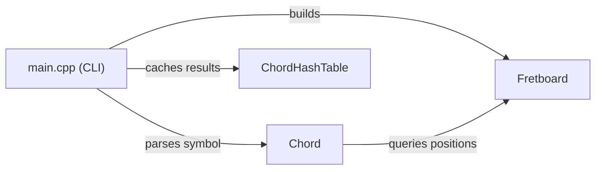
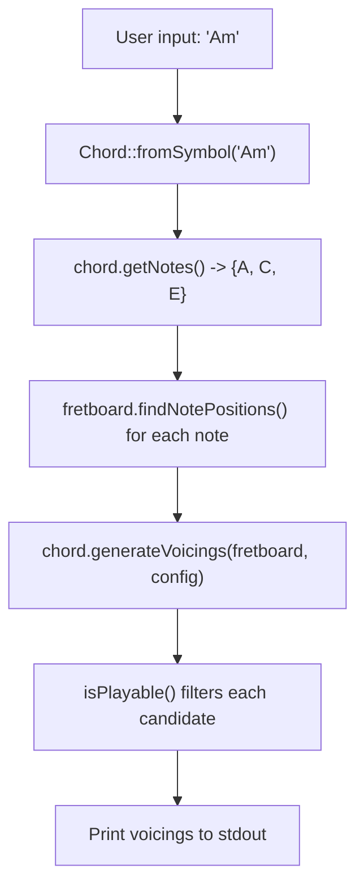

# Architecture

ChordArchitect is organized around three core modules inside the `ChordEngine` namespace, wired together by a CLI front-end in `main.cpp`.

## Module Overview



**Fretboard** models the guitar neck as a 2D grid of pitches. It knows nothing about chords.

**Chord** understands music theory: interval formulas, chord symbol parsing, and voicing generation. It depends on Fretboard to map notes to physical positions.

**ChordHashTable** is a pure data structure with no music knowledge. It stores `(string key, Chord, vector<Voicing>)` entries for O(1) lookup.

**CLI** (`main.cpp`) ties them together: it builds a Fretboard, parses user input into Chord objects, generates voicings, and optionally caches them in the hash table.

## Data Flow

A chord query goes through this pipeline:



1. The CLI receives a chord name (argument or REPL input)
2. `Chord::fromSymbol` parses it into a root note + quality
3. `getNotes()` applies the interval formula to produce pitch classes
4. `generateVoicings()` finds every fret on each string where those notes appear, enumerates all combinations, and filters by playability
5. Surviving voicings are printed to the user

## File Layout

```
include/ChordEngine/
    Fretboard.h        Note, Pitch, Fretboard declarations
    Chord.h            Voicing, PlayabilityConfig, Chord declarations
    ChordHashTable.h   SlotState, ChordEntry, ChordHashTable, Iterator declarations

src/
    Fretboard.cpp      Note/Pitch arithmetic, grid construction, queries
    Chord.cpp          Formula registry, parsing, voicing generation, playability
    ChordHashTable.cpp DJB2 hashing, linear probing, insert/find/remove, iterator
    main.cpp           CLI: argument parsing, REPL, processChord helper

tests/
    main_tests.cpp     Catch2 unit tests for all three modules
```

## Key Design Decisions

### Pre-computed fretboard grid

The `Fretboard` constructor builds a `vector<vector<Pitch>>` grid once, so every subsequent `getPitchAt` / `getNoteAt` call is a direct array access (O(1)) rather than recomputing the pitch from the tuning each time. For a 6-string, 22-fret guitar the grid is 138 entries, so the memory cost is negligible.

### Brute-force voicing generation with backtracking filter

`generateVoicings` builds per-string candidate lists (every fret where a chord note appears, plus a mute option) and recursively enumerates all combinations. Each complete combination is tested by `isPlayable()`. This is simple and correct. The candidate space is bounded by fret count and string count, so it completes in well under a second for standard guitar parameters.

### Linear probing with tombstone deletion

The `ChordHashTable` uses open addressing with linear probing because it has better cache locality than chaining for small tables. Deleted entries are marked as tombstones to preserve probe chains. The load factor is capped at 0.75 and the table doubles in size when exceeded, discarding tombstones during rehash.

### DJB2 hash function

A hand-written DJB2 hash (seed 5381, multiply by 33, add character) is used instead of `std::hash<string>` to keep the implementation educational and self-contained. DJB2 produces good distribution for short ASCII strings like chord names.
